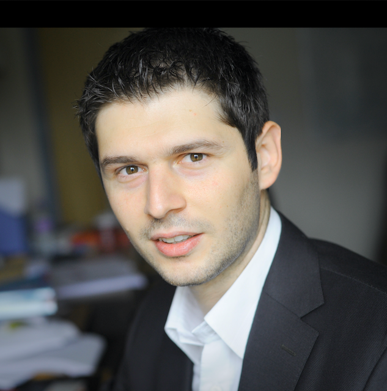

 

Dr Theodore Koutmeridis is a Senior Lecturer in Economics at the Adam Smith Business School at the University of Glasgow, where he coordinates the <a href="https://www.gla.ac.uk/research/az/bsi">Behaviour, Structure and Interventions</a> interdisciplinary research network. He holds a PhD in Economics from Warwick University where he was a Royal Economic Society Junior Fellow and an Onassis Scholar. His work on inequality, poverty and crime has been recognised with various awards, such as the Sir Alec Cairncross Prize in Economics, the 1st Prize of the European Science Days Interdisciplinary Award and has been featured in the media and various symposia, such as his TEDx talk on <a href="https://www.youtube.com/watch?v=wLvewC5f_dU">The Underground Economy</a>. His work has been awarded grants for research, teaching, impact and engagement, and is currently funded via a £700,000 <a href="https://www.gla.ac.uk/research/az/accountability/">ESRC-DFID</a> grant for education accountability in disadvantaged Indian schools. He is committed to outreach, impact and policy, and he has contributed to various consultations and policy reports. He is a Research Fellow at the Institute of Labor Economics IZA and he was a Visiting Scholar with Principal's Fellowship at Columbia University. More recently he received the <a href="https://www.gla.ac.uk/myglasgow/news/headline_517455_en.html?utm_medium=email&utm_source=newsletter&utm_campaign=http://www.gla.ac.uk/myglasgow/news/">British Academy Rising Star Award</a> and the <a href="https://www.youngacademyofscotland.org.uk/news/dr-theodore-koutmeridis-wins-rse-henry-duncan-medal/">RSE Henry Duncan Medal</a>, which according to the Royal Society of Edinburgh, he has been awarded ''for his outstanding work in the field of economics where he combines a clear mastery of the microeconomic methodology, a keen instinct for its empirical applications and a deep commitment to engagement activities.''

Research
<a href="https://drive.google.com/open?id=1vdsElTF0eo-zLF7bTasCZNXo1dqfxcZo">The Changing Returns to Crime: Do Criminals Respond to Prices?</a>, _Review of Economic Studies_, 2019, with M. Draca and S. Machin.

<a href="https://drive.google.com/open?id=0By2tXgpm_39oTmt0UWVPbkhaRzg">Misallocation, Education Expansion and Wage Inequality</a>, submitted.

<a href="https://drive.google.com/open?id=1W2hblijAXs3J9YRlF3dJIGL3FWvhxhsF">Shaking Criminal Incentives</a>, submitted, with Y. Aoki.

<a href="https://">Corporate Inequality and Disadvantage in the Workplace</a>, new version soon, with B. Eberth.

<a href="https://">Sorting Inequality with Gender-Specific Credit Constraints</a>, new version soon.

Projects

<a href="https://www.gla.ac.uk/research/az/accountability/">Disadvantage & Participation Accountability Processes: Theory & Evidence from School Development & Management Committees in Karnataka, India</a>, 2018-2022, Co-I, ESRC-DFID, £700,000.

<a href="https://www.gla.ac.uk/research/az/bsi/inequalityconflictandviolence">Inequality, Conflict and Violence</a>, research network, 2017-2019, Principal Investigator, funded by the British Academy, £15,000.

<a href="https://www.gla.ac.uk/research/az/bsi/summerinstitutesoncommunityandchange">Summer Institute series on 'Community and Change'</a>, annual workshops, 2019-2022. Co-Organiser, funded via Principal’s Fund, £20,000 per year.

<a href="http://wrap.warwick.ac.uk/58068/1/WRAP_THESIS_Koutmeridis_2013.pdf">The Market for 'Rough Diamonds': Information, Finance and Wage Inequality</a>, Doctoral Dissertation, University of Warwick, 2013, funded via Onassis PhD Scholarship, £35,000.

Teaching
<a href="https://www.gla.ac.uk/coursecatalogue/course/?code=ECON5101">Understanding Development: A Multidisciplinary Approach</a>, since 2017.

<a href="https://www.gla.ac.uk/coursecatalogue/course/?code=ECON5073">Behavioural Economics: Theory and Applications</a>, since 2017.

Past Teaching: Labor Economics, Economics of Innovation, Research Methods, Macro, Econometrics.

PhD Methods Training: Identifying Causal Effects, Finding Gaps in the Lit, Advice for Viva.

Media

<a href="https://drive.google.com/open?id=1X9roPuCMJKUG4zYvJ-uEb7tyJxaInkrV">Interview: RSE Henry Duncan Medal</a>, The Royal Society of Edinburgh, interview on pages 8-9.

<a href="https://www.youtube.com/watch?v=wLvewC5f_dU">The Underground Economy</a>, TEDx talk video.

<a href="https://researchtheheadlines.org/2017/09/21/talking-headlines-with-theo-koutmeridis-media-brexit-and-the-scottish-economy/">Brexit and Economics</a>, Interviewed by Dr Emma Carroll, Royal Society of Edinburgh Young Academy.

<a href="https://www.youtube.com/watch?v=14DxSm2E5VU">EPIP Conference Plenary video talk</a> launching Copyright Evidence in the Digital Economy. 

<a href="https://www.timeshighereducation.com/news/increasing-he-participation-increases-wage-inequality">Increasing HE participation ‘increases wage inequality’</a>, The Times Higher Education.

Policy

<a href="https://www.youngacademyofscotland.org.uk/wp-content/uploads/BREXIT_the_impact_on_scotland.pdf">Brexit and the Scottish Economy: Risks, Opportunities and the Revenge of the Disadvantaged</a>. In: Brexit: The Impact on Scotland. Royal Society of Edinburgh, Young Academy of Scotland, 2017.

REF 2021 Impact Case Study, with Counter Fraud Services, NHS Prevention Team to recover £1-5 million per year. Awards: “NHS Excellence in Innovation Award” and “Glasgow University KE Award in Policy”.

Consulting Her Majesty’s Government, Intellectual Property Office, UK Government.

Consulting the RSE, Working Groups on <a href="https://www.rse.org.uk/cms/files/advice-papers/2016/AP16_23.pdf">"Inequality"</a>; "Brexit & the Economy"; ”Financial Support for Students”; "Brexit & International Students" and "Brexit, Migration & Salary Threshold"; "COVID-19, Inequalities and Human Rights" & RSE response to the call for evidence by Scottish Government <a href="https://www.rse.org.uk/wp-content/uploads/2020/07/Just-Transition-Commission-Final-Published-Version.pdf">"Just Transition Commission".

Events

Workshops Organised: <a href="http://cep.lse.ac.uk/_new/events/event.asp?id=512">LSE Crime Workshop</a>, <a href="http://cep.lse.ac.uk/_new/events/event.asp?id=578">LSE Youngsters in Crime Workshop</a>, <a href="https://www.gla.ac.uk/research/az/bsi/events">BSI events</a>.

Selected Talks: <a href="https://www.youtube.com/watch?v=wLvewC5f_dU">TEDx on The Underground Economy</a>; Crime Lab New York; Public Lecture on Shifting Paradigms, Public Lecture on the Economics of Crime.

Contact

Gilbert Scott Building, East Quad, University of Glasgow, G12 8QQ, UK. <a href="https://drive.google.com/open?id=1TOothahOgkqrJULOJooA37D1CObEJVqo">Map to my office</a>.

Office Hours: Wednesdays 16:30-18:30. <a href="https://docs.google.com/spreadsheets/d/1MJxlb7h8nisE_aNPsQmfIIxtGko3QPJFUlH6Ak6J2L8/edit#gid=0">Please sign up here</a>, or email me for an appointment.
 

<a class="twitter-timeline" data-width="400" data-height="430" data-theme="light" data-link-color="#000000" data-chrome="transparent nofooter noborders noheader" href="https://twitter.com/TheoKoutmeridis/timelines/1191519201393086472?ref_src=twsrc%5Etfw">Tweets by TheoKoutmeridis</a> 

